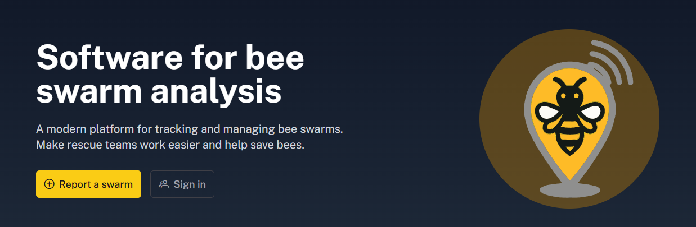

# Software for Bee Swarm Analysis



A web application for locating and managing bee swarm reports. Citizens can report a swarm on an interactive map, and the system automatically assigns the nearest available beekeeper, notifying them by email with navigation directly to the location.

| Layer | Stack |
|---|---|
| **Frontend** | Angular 20, PrimeNG, Leaflet, Tailwind CSS, Transloco (cs/en) |
| **Backend** | NestJS 11, TypeORM, MySQL/MariaDB, JWT (httpOnly cookies), Nodemailer |
| **Infrastructure** | Docker Compose (frontend, backend, database) |

For detailed documentation, see [`Frontend`](./FE/README.md) and [`Backend`](./BE/README.md) `README`.

---

# Docker

Quick reference for managing the application stack with Docker Compose.

---

## First Deployment

Build images and start all services for the first time:

```bash
docker-compose up -d --build
```

---

## Common Commands

#### Start containers
```bash
docker-compose up -d
```

#### Stop containers (data is preserved)
```bash
docker-compose down
```

#### Rebuild and redeploy without data loss
```bash
docker-compose down
docker-compose build
docker-compose up -d
```

---

## Database Access

Connect to the MySQL database inside the running container:

```bash
docker-compose exec mysql mysql -u root -p software_for_bee_swarm_analysis
```

---

## ⚠ Factory Reset

Stops all containers and **permanently deletes all volumes** (database data, uploaded files):

```bash
docker-compose down -v
```